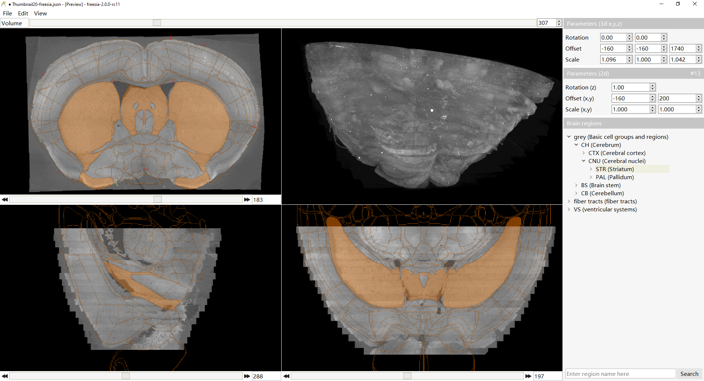

# freesia-mapping

Freesia is a software designed to manually register histological slice images to the Allen Mouse Common Coordinate Framework ([CCF v3](https://scalablebrainatlas.incf.org/mouse/ABA_v3)).

## Basic usage

The whole procedure of images registration in freesia consists of 3 parts, 3d rigid transform on CCF, 2d rigid transform on images and 2d deformation on images. Currently, all images in the same data set need to have the same size and brain slices in the images need to be roughly centered and rotation-free. 3d/2d rigid transform is controlled by right-top/middle panel, which consists of 3d/2d rotation, translation and scaling. 2d deformation is a key point-based method which requires some manually labeled point pairs. More detailed information can be found in [doc/usage.md](doc/usage.md).

## Demo data

A image with detected cells list were contained in folder *demo-data*, within the "all-in-one" software release bundle. Import image or Load *json* project to see how it works. Image sequences are also supported and you can try it yourself on your own dataset.

## Building the code

Currently this program only supports Windows 64-bit systems.

Before building the code, the following prerequisites be must be compiled and installed.

* [Qt](https://www.qt.io/) 5.9.8 with compiler msvc2015_64 (v140)
* [VTK](https://vtk.org/) 8.2.0 with VTK_Group_Qt and VTK_ENABLE_KITS enabled
* [OpenCV](https://opencv.org/) 3.4.0 with BUILD_opencv_world enabled
* [nn-c](https://github.com/sakov/nn-c), a library for interpolation of 2D scattered data. Here we use our modified version [nn-c-windows](https://github.com/dinglufe/nn-c-windows) to make it easier to build on Windows 64-bit platform.

This repository do not use git submodules but use a WordPress-like configuration strategy. Copy file *dependencies.pri.tmpl* to *dependencies.pri* and modify *dependencies.pri* according to the actual  locations of the dependencies, and then the code can be compiled in Qt Creator under release mode.

The icon of freesia comes from [pixabay](https://pixabay.com/photos/flowers-yellow-flowers-freesia-1766876/).

[3D Slicer](https://www.slicer.org/) was heavily referenced in software development.

## License

[Apache License version 2.0](https://www.apache.org/licenses/LICENSE-2.0), without commercial permission.
